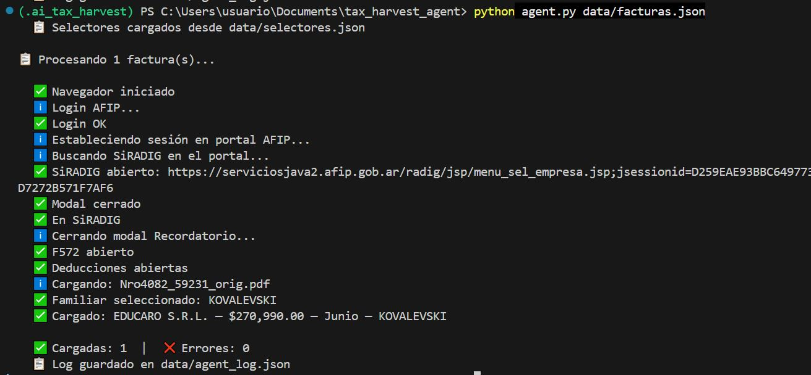

# 🌿 Tax Harvest Agent

> A GAME-architecture agent that automates Argentine tax deductions (AFIP/ARCA) using Playwright + OpenAI GPT-4o.

## What it does

Every month, Argentine workers in the "4th category" (employees) must manually upload expense receipts to [SiRADIG / ARCA](https://serviciosjava2.afip.gob.ar) — Argentina's tax authority portal — to reduce their income tax withholding. This is a repetitive copy-paste task: read a PDF invoice, open the government portal, navigate 6+ screens, fill a form, upload the receipt, repeat for each invoice.

This agent automates the full cycle:

```
PDF invoices → GPT-4o extraction → Review UI → Playwright agent → ARCA/SiRADIG
```

## Architecture (GAME)

The agent follows the **GAME** framework (Goals, Actions, Memory, Environment):

| Component | Implementation |
|---|---|
| **Goal** | Upload deductible expenses to minimize income tax withholding |
| **Actions** | `read_pdf` → `extract_data` → `login_afip` → `navigate_siradig` → `fill_form` → `upload_receipt` |
| **Memory** | `data/facturas.json` — tracks state of each invoice (pending / approved / loaded / error) |
| **Environment** | Local PDF folder + Chromium browser controlled by Playwright |

## Stack

- **Python 3.11+**
- **Playwright** — browser automation against AFIP's legacy JSP/jQuery UI portal
- **OpenAI GPT-4o** — PDF parsing and structured data extraction
- **Flask** — lightweight review UI before the agent loads anything
- **pdfplumber** — text extraction from digital PDFs

## Project structure

```
tax_harvest_agent/
│
├── extractor.py       # Reads PDFs, calls GPT-4o, outputs structured JSON
├── agent.py           # Playwright agent — navigates ARCA and fills forms
├── app.py             # Flask review UI — approve/edit invoices before loading
├── run.py             # Single entry point — orchestrates the full flow
├── debug_session.py   # Interactive selector mapper for ARCA's unstable DOM
│
├── .env.example       # Template — add your own credentials
├── requirements.txt
│
├── facturas/          # ← drop your PDF invoices here each month
├── procesadas/        # Processed PDFs move here automatically
└── data/
    ├── facturas.json  # Invoice state tracking
    └── selectores.json # Confirmed DOM selectors for ARCA
```

## The hard part: debugging AFIP

AFIP's portal (`serviciosjava2.afip.gob.ar`) is a legacy JSP app with jQuery UI, and it has a few quirks that required custom solutions:

- **SSO cookies don't transfer on direct URL navigation** — the agent has to click through the main portal (`portalcf.cloud.afip.gob.ar`) and capture the new tab opened by `SiRADIG - Trabajador` using Playwright's `expect_page()`
- **Dynamic DOM** — the "password" field doesn't exist until after you submit the CUIT; selectors have to be discovered in two separate steps
- **Modal overlays** — a "Recordatorio" modal appears with a 2-second delay after login; if not dismissed it blocks all subsequent clicks via `ui-widget-overlay`
- **Sibling disambiguation** — when two family members share a surname, the radio button selection in the "Familiar" modal requires filtering by both `apellido` AND `nombre` inside `#tabla_cargas_familia`
- **Selector stability** — `debug_session.py` is an interactive tool to re-map selectors when AFIP changes its DOM without notice

## Monthly workflow

```bash
# 1. Drop PDF invoices in facturas/
# 2. Extract data
python extractor.py ./facturas

# 3. Review & approve in the browser UI
python app.py

# 4. Load to ARCA automatically
python agent.py data/facturas.json
```

Or run everything in one command:

```bash
python run.py
```

## Setup

```bash
# Create virtualenv
python -m venv venv
source venv/bin/activate  # Windows: venv\Scripts\activate

# Install dependencies
pip install -r requirements.txt
playwright install chromium

# Configure credentials
cp .env.example .env
# Edit .env with your AFIP CUIT, clave fiscal, and OpenAI API key
```

## Status

| Feature | Status |
|---|---|
| PDF extraction (education expenses) | ✅ Working |
| ARCA navigation & form fill | ✅ Working |
| Family member disambiguation | ✅ Working |
| Review UI (Flask) | ✅ Working |
| Mortgage interest deductions | 🔄 In progress |
| Image input (phone photos of receipts) | 📋 Planned |
| Multi-user / SaaS version | 📋 Planned |


## 📸 Sample Output




## What I learned

Building this required dealing with a government portal that was never designed to be automated. The main lesson: **the browser automation is the easy part — understanding the business domain (Argentine tax law, form structure, fiscal periods) is where most of the complexity lives**.

The `debug_session.py` tool ended up being as valuable as the agent itself — it's an interactive Playwright session that walks you through each step, tests selectors, and saves the confirmed ones to JSON for the agent to reuse.

---

*Built as a learning project on GAME agent architecture. All credentials stay local — no data leaves your machine except the PDF text sent to OpenAI for extraction.*
